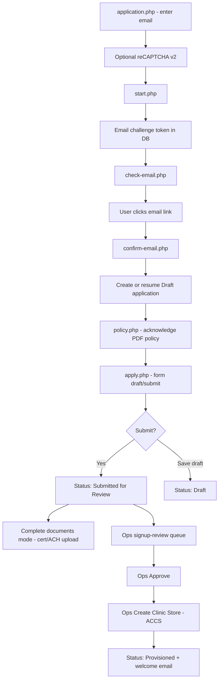

# Agent handoff — Provider Signup process & ACCS provisioning

Continuation document for agents working on NutraAxis practitioner/provider onboarding.  
**Last updated:** 2026-08-01  
**Repo:** `nutraaxis` on Azure App Service **`nutraaxisweb`**

---

## 1. Executive summary

The **provider signup** flow is a public marketing-site experience where practitioners apply for a co-branded Clinic Store. Applications are stored in Azure SQL, reviewed in the **Operations portal**, and on approval are provisioned into **Adobe Commerce Cloud Service (ACCS)** as a B2B **company** + **customer** (company admin).

**All provider-signup process work described here is merged to `main`.** It was built across multiple feature branches (see §10). Nothing signup-related is blocked on an open PR except unrelated work (e.g. procurement ledger PR #20).

**Public URL:** `https://provider-signup.nutraaxislabs.com` (subdomain → `/provider-signup` on `nutraaxisweb`)  
**Ops review:** `https://operations.nutraaxislabs.com/operations-dashboard/signup-review/` (or `/operations-dashboard/signup-review/` on same app)

---

## 2. End-to-end provider flow



### Step-by-step (happy path)

| Step | URL / endpoint | What happens |
|------|----------------|--------------|
| 1 | `GET /provider-signup/application.php` | Landing; practitioner enters email |
| 2 | `POST /provider-signup/start.php` | Rate-limited email challenge; optional reCAPTCHA verify |
| 3 | `GET /provider-signup/check-email.php` | “Check your inbox” page |
| 4 | Email link → `GET /provider-signup/confirm-email.php?token=…` | Consumes challenge; creates/resumes `ProviderSignupApplication` (Draft); redirects to policy |
| 5 | `GET /provider-signup/policy.php?token=…` | Must acknowledge Practitioner Reseller Policy PDF before form |
| 6 | `GET /provider-signup/apply.php?token=…` | Full application form (company, admin, NPI, tax, ACH, certificate upload) |
| 7 | `POST` save draft or submit | Submit → **Submitted for Review**; optional cert/ACH warnings if missing |
| 8 | Post-submit | **Complete documents** mode: same token URL; upload certificate + save ACH (form fields locked) |
| 9 | Ops | Review at `operations-dashboard/signup-review/view.php?id=…` |
| 10 | Ops **Approve** | Status → **Approved** (provider not emailed yet) |
| 11 | Ops **Create Clinic Store** | ACCS provision → Status → **Provisioned**; **welcome email** sent |

### Important behavior notes

- **No app row until email confirmed** — `start.php` only creates `ProviderSignupEmailChallenge`; application row is created in `confirm-email.php`.
- **Policy gate** — `apply.php` redirects to `policy.php` until current policy version is acknowledged (`sql/119_provider_signup_policy_ack.sql`).
- **Submit without cert/ACH** — Allowed with warnings; taxable / no-payout messaging shown. Provider can return via same token to complete documents.
- **Provider cannot edit full form** after submit (except **Returned** / **Draft**). Certificate + ACH editable in **complete-documents** statuses.
- **Ops must approve before provision** — Provider is **not** emailed “Clinic Store ready” until provisioning completes.

---

## 3. Application statuses

Defined in `includes/provider-signup.php`:

| Status | Provider can edit form? | Complete documents? | Ops actions |
|--------|-------------------------|---------------------|-------------|
| `Draft` | Yes | No | Edit, comment, approve |
| `Submitted for Review` | No | Yes (cert/ACH) | Edit, validate NPI, approve, return, reject |
| `Returned` | Yes | Yes | Same as submitted |
| `Pending Validation` | No | Yes | Ops workflow |
| `Approved` | No | Yes | **Create Clinic Store** (provision) |
| `Provisioned` | No | Yes | View only; ACCS IDs stored |
| `Rejected` | No | No | Terminal |

Status constraint migration: `sql/124_provider_signup_status_submitted_for_review.sql` (renamed `Submitted` → `Submitted for Review`).

---

## 4. Public pages & includes

### Routes (`provider-signup/`)

| File | Role |
|------|------|
| `index.php` | Redirect/landing |
| `application.php` | Start form (email + reCAPTCHA) |
| `start.php` | POST handler for email challenge |
| `check-email.php` | Post-start confirmation page |
| `confirm-email.php` | Consumes challenge token |
| `policy.php` | Policy acknowledgement |
| `apply.php` | Main form, upload, submit, complete-documents |

### Core includes

| File | Role |
|------|------|
| `includes/provider-signup.php` | DB, statuses, submit, ops actions, provision orchestration |
| `includes/provider-signup-form.php` | Provider-facing form UI |
| `includes/provider-signup-landing.php` | Marketing landing/apply chrome |
| `includes/provider-signup-mail.php` | All provider/ops emails |
| `includes/provider-signup-recaptcha.php` | reCAPTCHA v2 siteverify |
| `includes/provider-signup-accs.php` | **ACCS API integration** |
| `includes/provider-signup-accs-config.php` | **ACCS clinic configuration automation** (shared catalog, roles) |
| `includes/provider-signup-crypto.php` | Encrypt tax ID, ACH, attachments |
| `includes/provider-signup-npi.php` | NPI validation |
| `includes/provider-signup-npi-snapshot.php` | NPPES registry snapshots |
| `includes/provider-signup-ops-form.php` | Ops edit form |
| `includes/marketing-head.php` | Marketing `<head>` + **GA4** |
| `includes/marketing-footer.php` | Shared footer (cert badges) |
| `includes/marketing-site.php` | Marketing helpers + GA measurement ID |
| `includes/subdomain-routing.php` | `provider-signup.nutraaxislabs.com` → `/provider-signup` |

### Ops module

| Path | Role |
|------|------|
| `operations-dashboard/signup-review/index.php` | Queue list |
| `operations-dashboard/signup-review/view.php` | Detail, approve, provision, return, reject, NPI validate |
| `operations-dashboard/signup-review/application-form.php` | Ops edit application |
| `operations-dashboard/signup-review/attachment.php` | Download certificate |

**Permission column:** `ProviderAccountReview` in `includes/auth.php` / `dbo.Role`.

---

## 5. ACCS provisioning (Adobe Commerce)

### Entry points

- `provider_signup_ops_provision($applicationId)` — ops button; requires `ProviderAccountReview` update permission
- `provider_signup_finalize_provision()` — sets DB status, logs, sends welcome email
- `provider_signup_provision()` → `provider_signup_accs_provision($application)`

### ACCS call sequence (`provider_signup_accs_provision`)

1. Validate Adobe Commerce config (`adobe_commerce_config_error()`)
2. Validate **clinic type** on application
3. **`provider_signup_accs_ensure_company_admin`**
   - Search customer by admin email
   - If exists: ensure **customer group** = Practitioner group
   - If not: **`POST /customers`** with generated password
4. **`provider_signup_accs_create_company`**
   - Map US state → region ID via `GET /directory/countries/US`
   - **`POST /company`** with company payload (name, legal name, address, NPI as `reseller_id`, tax ID as `vat_tax_id`, etc.)
5. **`provider_signup_accs_set_company_defaults`**
   - **`PUT /company/{id}`** to force `customer_group_id` and `sales_representative_id`
6. **`provider_signup_accs_set_clinic_type`**
   - **`POST /company/setCustomAttributes`** with attribute `clinic-type`

### ACCS defaults (env-overridable)

| Setting | Env var | Default | Purpose |
|---------|---------|---------|---------|
| Target ACCS tenant | `PROVIDER_SIGNUP_ACCS_ENVIRONMENT` | `stage` locally; **`production`** on live App Service | Which Adobe tenant API to hit |
| Customer group | `PROVIDER_SIGNUP_ACCS_USER_GROUP_ID` | **4** | Practitioner shared catalog |
| Sales rep | `PROVIDER_SIGNUP_ACCS_SALES_REPRESENTATIVE_ID` | **12** | `Sales_Support` admin user on company |
| Website | `PROVIDER_SIGNUP_ACCS_WEBSITE_ID` | **1** | Magento website ID |
| Test password | `PROVIDER_SIGNUP_ACCS_DEFAULT_PASSWORD` | (auto-generated) | Optional fixed password for stage |

### Stored on application after provision

- `AccsCompanyId` — ACCS company ID
- `AccsCustomerId` — company admin customer ID
- `AccsClinicId` — currently set to **company ID string** (clinic storefront ID for email)
- `ProvisionedAt`, `LastProvisionError`

### Clinic configuration step tracking (`sql/135_provider_signup_accs_config_steps.sql`)

Five ACCS setup steps are tracked on `dbo.ProviderSignupApplication` with `AccsStep*Done` / `AccsStep*At` columns plus supporting IDs (`AccsSharedCatalogId`, `AccsCatalogCategoryCount`, `AccsCatalogProductCount`, `AccsRolesSummary`). `AccsConfigurationComplete` is set when all five are done.

| Step | Auto on Create Clinic Store? | Notes |
|------|------------------------------|-------|
| Clinic (company) | Yes | Sets `AccsStepClinicDone` + `AccsCompanyId` |
| Clinic admin | Yes | Sets `AccsStepAdminDone` + `AccsCustomerId` |
| Shared catalog | Yes (automation) or manual | Creates/reuses `SC-{CompanyName}`; ops can still mark manually |
| Categories & products | Yes (automation) or manual | Clones from master shared catalog; assigns company |
| Company roles | Yes (automation) or manual | Clones template roles; verifies required role names |

**Ops UI:** Application view → **Clinic configuration** card with checklist, **Complete ACCS clinic configuration** button (Provisioned + incomplete), and per-step **Mark complete** forms (Approved or Provisioned only).

**PHP helpers** (`includes/provider-signup.php`):

- `provider_signup_config_steps($application)` — normalized step list for UI
- `provider_signup_config_steps_complete($application)`
- `provider_signup_ops_mark_config_step($applicationId, $step, $extra)` — manual confirm + validation; logs to review history
- `provider_signup_ops_complete_accs_configuration($applicationId)` — ops button / automation entry point
- `provider_signup_persist_accs_config_result($applicationId, $result)` — writes step columns + `provider_signup_recompute_configuration_complete()`
- `provider_signup_list_applications_needing_accs_config($limit)` — batch queue (Provisioned, incomplete)

**ACCS automation** (`includes/provider-signup-accs-config.php`):

- `provider_signup_accs_complete_clinic_configuration($application)` — shared catalog, catalog assign, roles clone
- Runs automatically after successful **Create Clinic Store** (non-fatal if automation fails; review log comment)
- Batch CLI: `php scripts/provider-signup-complete-accs-config.php` (`--id=`, `--limit=`)
- Bootstrap template company + roles: `php scripts/provider-signup-bootstrap-clinic-template.php`

**Automation env** (in addition to `ADOBE_COMMERCE_*`):

| Variable | Default | Purpose |
|----------|---------|---------|
| `PROVIDER_SIGNUP_ACCS_MASTER_SHARED_CATALOG_ID` | `1` | Source catalog for categories/products |
| `PROVIDER_SIGNUP_ACCS_TEMPLATE_COMPANY_NAME` | `Clinic_Template` | Auto-resolved template company for role cloning |
| `PROVIDER_SIGNUP_ACCS_TEMPLATE_COMPANY_ID` | (none) | Optional explicit ID; otherwise lookup by name |
| `PROVIDER_SIGNUP_ACCS_TEMPLATE_SOURCE_ENVIRONMENT` | `dev` | Bootstrap script copies role permissions from this ACCS tenant |
| `PROVIDER_SIGNUP_ACCS_TEMPLATE_SOURCE_COMPANY_ID` | `5` | Dev Butler Health (full clinic roles; Stage Butler only has Default User) |
| `PROVIDER_SIGNUP_ACCS_TEMPLATE_ROLE_IDS` | (none) | Optional comma-separated template role IDs instead of company clone |
| `PROVIDER_SIGNUP_ACCS_REQUIRED_ROLE_NAMES` | `Default User,Owner,Company_Admin,Provider,Affiliated Patients` | Post-clone verification |

### Company payload highlights (`provider_signup_accs_build_company_payload`)

- `company_name`, `legal_name`, `company_email`, address fields
- `vat_tax_id` ← decrypted tax ID
- `reseller_id` ← NPI number
- `customer_group_id`, `sales_representative_id`, `super_user_id` (admin customer)
- `comment` includes application ID and clinic type

### Adobe Commerce credentials

Uses shared `includes/adobe-commerce.php` / `ADOBE_COMMERCE_*` env vars. Provisioning respects `PROVIDER_SIGNUP_ACCS_ENVIRONMENT` (not the page-level UAT toggle unless wired elsewhere).

**Production ACCS Admin:** `https://na1.admin.commerce.adobe.com/VLuKe3eeTwf1D5oxmLBfcr`  
**Stage ACCS Admin:** `https://na1-sandbox.admin.commerce.adobe.com/UAEyTrirS4qBMAWYZa4uic`

---

## 6. Email flows

All in `includes/provider-signup-mail.php`. Sent via Office 365 SMTP (`notifications@nutraaxislabs.com`) when `SMTP_*` configured on App Service.

| Trigger | Function | Recipient | Notes |
|---------|----------|-----------|-------|
| Email challenge (start) | `provider_signup_mail_email_challenge` | Provider email | 60 min TTL; link to `confirm-email.php` |
| After confirm (optional) | `provider_signup_mail_application_started` | Provider | Continue link to policy (skipped on confirm path — ops-only variant used) |
| New app started | `provider_signup_mail_application_started_ops` | `PROVIDER_SIGNUP_OPS_EMAIL` or `NutraAxis@nfcllc.com` | Internal alert |
| After submit | `provider_signup_mail_application_submitted` | Provider | Return link; CTA if cert/ACH missing |
| Ops comment | `provider_signup_mail_commented` | Provider | |
| Ops return | `provider_signup_mail_returned` | Provider | Apply link |
| Ops reopen | `provider_signup_mail_reopened` | Provider | |
| After provision | `provider_signup_mail_provisioned` | Provider | **Branded HTML welcome**; `support@nutraaxislabs.com`; sign-in + Clinic ID + temp password |

**Welcome email subject:** `Welcome to NutraAxis — your Clinic Store account is ready`  
**Logo:** `/assets/logos/nutraaxis-logo-email.png` (absolute URL via `SITE_URL`)  
**Sign-in URL:** `PROVIDER_ACCS_LOGIN_URL` or `NUTRAAXIS_STORE_URL` (default `https://www.nutraaxislabs.com`)

**Test/sample provisioned email (secured cron):**  
`GET /cron/send-provisioned-mail-sample.php?to=…&application_id=20` with header `X-Cron-Secret: $CRON_SECRET`

**Mail pitfall:** Local CLI without `SMTP_PASS` uses PHP `mail()` and silently does not deliver. Always test via **production Azure SMTP** or the cron endpoint above.

---

## 7. Security & validation

### reCAPTCHA v2 (optional on start form)

- Env: `PROVIDER_SIGNUP_RECAPTCHA_SITE_KEY`, `PROVIDER_SIGNUP_RECAPTCHA_SECRET_KEY`
- Verify: `includes/provider-signup-recaptcha.php` → Google `siteverify`
- E2E bypass: `PROVIDER_SIGNUP_E2E_START_SECRET` POST field `e2e_start_secret`

### Email challenge rate limits

- 5 per email / hour, 20 per IP / hour
- Table: `dbo.ProviderSignupEmailChallenge` (`sql/128_provider_signup_email_challenge.sql`)

### Encryption

- Tax ID, ACH account number: `provider-signup-crypto.php`
- Certificate attachments: Azure Blob + app encryption (`FILE_CRYPTO_ENCRYPTION_KEY` or legacy `PROVIDER_SIGNUP_ENCRYPTION_KEY`)
- Migration: `sql/116_provider_signup_attachment_blob.sql`

### NPI

- Validation + NPPES snapshot: `provider-signup-npi.php`, `provider-signup-npi-snapshot.php`
- Table: `dbo.ProviderSignupNpiSnapshot` (`sql/114_create_provider_signup_npi_snapshot.sql`)
- Ops action: **Validate NPI** on review view

---

## 8. Google Analytics (provider signup pages)

- Measurement ID: **`G-DDPDCVQCLJ`** (constant `MARKETING_GA_MEASUREMENT_ID` in `marketing-site.php`)
- Override/disable: `GA_MEASUREMENT_ID` env (`off` to disable)
- Rendered in `marketing-head.php` via `marketing_site_render_ga_tag()`
- **Does not** cover `www.nutraaxislabs.com` (Adobe EDS — separate repo / `head.html` or GTM Martech plugin)

---

## 9. SQL migrations (run in order if bootstrapping fresh)

| File | Purpose |
|------|---------|
| `sql/112_create_provider_signup.sql` | Core tables, role column |
| `sql/113_alter_provider_signup_clinic_type.sql` | Clinic type column |
| `sql/114_create_provider_signup_npi_snapshot.sql` | NPI snapshots |
| `sql/115_provider_signup_review_log_reopened.sql` | Review log action |
| `sql/116_provider_signup_attachment_blob.sql` | Blob storage for certificates |
| `sql/119_provider_signup_policy_ack.sql` | Policy acknowledgement fields |
| `sql/124_provider_signup_status_submitted_for_review.sql` | Status rename constraint |
| `sql/128_provider_signup_email_challenge.sql` | Email challenge table |
| `sql/135_provider_signup_accs_config_steps.sql` | ACCS clinic configuration step tracking columns |

Run: `node scripts/run-sql-file.js sql/<file>` with local `.env` `DB_*`.

---

## 10. Git history — branches merged to `main`

All provider signup process work is on **`main`**. Feature branches below were merged (branch tips may differ from merge commits).

| Feature | Branch | Key commit(s) on `main` |
|---------|--------|-------------------------|
| Core apply + ops review UI | `cursor/provider-signup-apply-ui` | `011ceeb` |
| Ops approve → ACCS provision | PR **#14** `cursor/provider-signup-approve-then-activate` | `6539f3c`, `ec5a9ce` |
| Policy ack, submit flow | `feature/provider-signup-submit-flow` | `6ad9816`, `cc8fbdc`, `de76e4c` |
| Live copy / Central Time dates | `fix/provider-signup-live-copy-and-ops-dates` | `9176859` |
| Optional cert/ACH + complete-documents | `feature/provider-signup-optional-documents` | `1998591` → `8f47d2e` |
| Email confirm + reCAPTCHA | `feature/provider-signup-email-captcha` | `f48bd65` → `96761d7` |
| Post-submit return-link email | `feature/provider-signup-submit-linkback-email` | `b303cc7` → `d1c8910` |
| Branded provisioned welcome email | `feature/provider-signup-provisioned-welcome-email` | `eac6441` → `b013759` |
| Welcome email apostrophe fix | direct on `main` | `1d21b8a` |
| GA4 on marketing pages | `feat/ga-provider-signup-analytics` | `aa8399f` → `540487f` |
| Footer cert logo CSS fix | direct on `main` | `8e9ffa2` |
| Sample provisioned email cron | direct on `main` | `8582c44` |

**Not provider signup:** PR **#20** `feat/procurement-ledger-phase-2` (procurement LedgerProfile only).

---

## 11. Environment variables (`.env.example` section)

```text
# Provider signup
PROVIDER_SIGNUP_OPS_EMAIL=          # Internal new-application alert
PROVIDER_ACCS_LOGIN_URL=            # Sign-in link in welcome email
PROVIDER_SIGNUP_ACCS_ENVIRONMENT=   # production | stage
PROVIDER_SIGNUP_ACCS_USER_GROUP_ID=4
PROVIDER_SIGNUP_ACCS_SALES_REPRESENTATIVE_ID=12
PROVIDER_SIGNUP_ACCS_WEBSITE_ID=1
PROVIDER_SIGNUP_ACCS_DEFAULT_PASSWORD=
PROVIDER_SIGNUP_ACCS_MASTER_SHARED_CATALOG_ID=1
PROVIDER_SIGNUP_ACCS_TEMPLATE_COMPANY_NAME=Clinic_Template
PROVIDER_SIGNUP_ACCS_TEMPLATE_COMPANY_ID=
PROVIDER_SIGNUP_ACCS_TEMPLATE_SOURCE_ENVIRONMENT=dev
PROVIDER_SIGNUP_ACCS_TEMPLATE_SOURCE_COMPANY_ID=5
PROVIDER_SIGNUP_ACCS_TEMPLATE_ROLE_IDS=
PROVIDER_SIGNUP_ACCS_REQUIRED_ROLE_NAMES=Default User,Owner,Company_Admin,Provider,Affiliated Patients
PROVIDER_SIGNUP_RECAPTCHA_SITE_KEY=
PROVIDER_SIGNUP_RECAPTCHA_SECRET_KEY=
PROVIDER_SIGNUP_E2E_START_SECRET=
FILE_CRYPTO_ENCRYPTION_KEY=         # or PROVIDER_SIGNUP_ENCRYPTION_KEY
SITE_URL=                           # Email links + logo URLs
GA_MEASUREMENT_ID=G-DDPDCVQCLJ       # or "off"
```

Plus standard `ADOBE_COMMERCE_*` for ACCS API auth.

---

## 12. Deploy & testing

### Deploy rules (from `AGENTS.md`)

- **Selective FTP only:** `node scripts/ftp-upload-files.js path1 path2 …`
- **Never** full `npm run upload` from feature branches
- After deploy to live, merge to `main` same session

### E2E UAT

- Doc: `docs/uat/provider-signup-e2e.md`
- Script: `npm run e2e:provider-signup-uat` (`scripts/e2e-provider-signup-uat.js`)
- Requires ops credentials + stage ACCS + blob keys

### Manual smoke checklist

1. Start at `provider-signup.nutraaxislabs.com/provider-signup/application.php`
2. Confirm email → policy → apply → submit (with/without cert)
3. Ops approve → Create Clinic Store
4. Confirm welcome email + ACCS company in admin
5. Return to apply URL in **complete-documents** mode; upload cert / ACH

### Known test data (example)

- Application **#20**: `test@groupbutler.com`, Clinic ID **2**, Status **Provisioned**, company **BG Clinic 5**

---

## 13. Related docs & files not in this repo

| Surface | Notes |
|---------|-------|
| `www.nutraaxislabs.com` | Adobe Edge Delivery Services — GA via EDS `head.html` or [GTM Martech plugin](https://www.aem.live/developer/gtm-martech-integration), not this PHP app |
| Product PDP enrichment | Separate module; enriches nutraaxislabs.com product pages |
| Public COA API | `includes/coa-public-api.php` — unrelated to signup |

---

## 14. Open questions / follow-ups for future agents

1. **Live vs `main` drift** — Confirm Azure wwwroot matches `main` for `provider-signup/` and `includes/provider-signup*` after fast-moving merges.
2. **Clinic storefront Aug 3 messaging** — Hardcoded in welcome email copy; update when go-live date changes.
3. **Per-clinic QR in email** — Not implemented; welcome email points users to Clinic Store admin after storefront is live.
4. **ACCS `AccsClinicId`** — Currently mirrors company ID; confirm if a separate clinic entity ID is introduced later.
5. **reCAPTCHA keys** — Must be set on Azure App Service; domains include `provider-signup.nutraaxislabs.com` and `nutraaxisweb.azurewebsites.net`.

---

## 15. Quick file grep anchors

```bash
# Status constants
rg "PROVIDER_SIGNUP_STATUS" includes/provider-signup.php

# ACCS provision
rg "provider_signup_accs_provision" includes/

# Ops provision button
rg "provider_signup_ops_provision" operations-dashboard/signup-review/

# Email templates
rg "function provider_signup_mail_" includes/provider-signup-mail.php
```
