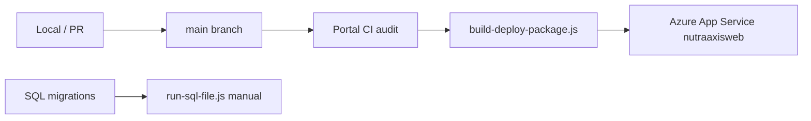

# Git-push deployment (Azure App Service)

How to replace manual FTP with **push to `main` → GitHub Actions → `nutraaxisweb`**.

Production app: **`nutraaxisweb`** (`operations.nutraaxislabs.com`).  
Today: FTPS via `node scripts/ftp-upload-files.js`.  
Target: GitHub Actions zip deploy so **live tracks `main`** and deploy-then-merge becomes merge-then-auto-deploy.

---

## Why FTP caused nav drift

| FTP pattern | Risk |
|-------------|------|
| Selective file upload | Module folder lands but `includes/app.php` / auth not updated |
| Full sync from stale branch | Overwrites hub cards and UAT wiring on live |
| Deploy without merging to `main` | Live ahead of git; next agent doesn't know what's live |
| Orphan cleanup script | Deletes redirect shims still linked from breadcrumbs |

Git-push deploy fixes the last three when **`main` is the only deploy source**.

---

## Recommended architecture



- **PHP/wwwroot:** GitHub Actions (`azure-deploy.yml`)
- **SQL:** Still manual — `node scripts/run-sql-file.js sql/<file>` (not in deploy zip)
- **Azure Functions:** Separate app (`functions/`) — not deployed with the portal zip

---

## One-time Azure setup

### 1. Add GitHub secret

1. Azure Portal → **App Service `nutraaxisweb`** → **Deployment Center**
2. **Manage publish profile** → download XML
3. GitHub repo → **Settings → Secrets and variables → Actions**
4. New secret: `AZURE_WEBAPP_PUBLISH_PROFILE` = entire XML file contents

### 2. Create GitHub environment (optional but recommended)

- Repo → **Settings → Environments** → `production`
- Add required reviewers if you want manual approval before live deploy

### 3. Confirm App Service settings (not in git)

These stay in **Azure → Configuration → Application settings** (never in the repo):

- `DB_*` / connection strings
- `QBO_*`, `AZURE_STORAGE_*`, `SMTP_*`, etc.

The deploy zip **excludes** `.env`, `sql/`, `docs/`, `scripts/`, `node_modules/`.

### 4. Disable competing deploy paths (after validation)

- Stop using `npm run upload` for routine releases
- Keep `upload:files` only for hotfix emergencies until auto-deploy is trusted
- Do **not** run `delete-orphaned-root-files.js` against production without the nav audit

---

## Workflows in this repo

| Workflow | Trigger | Purpose |
|----------|---------|---------|
| `.github/workflows/portal-ci.yml` | PR + push to `main` | Runs `php scripts/audit-portal-nav.php` |
| `.github/workflows/azure-deploy.yml` | Push to `main` (code paths) + manual | Audit → zip → deploy |

### First deploy test

1. Add `AZURE_WEBAPP_PUBLISH_PROFILE` secret
2. GitHub → **Actions** → **Deploy to Azure App Service** → **Run workflow** (branch `main`)
3. Smoke: home `/`, Procurement hub, Contacts List, login redirect
4. If good, rely on push-to-`main` deploy going forward

To pause auto-deploy on push while keeping manual runs, remove the `push:` trigger from `azure-deploy.yml` and use **workflow_dispatch** only.

---

## Local commands

```bash
# Nav wiring check (same as CI)
php scripts/audit-portal-nav.php

# Build the same zip CI deploys
node scripts/build-deploy-package.js deploy-package.zip
```

---

## Migration checklist

- [ ] `AZURE_WEBAPP_PUBLISH_PROFILE` secret added
- [ ] One successful **workflow_dispatch** deploy
- [ ] Smoke test live vs `main`
- [ ] Update team: **merge to `main` = deploy** (no FTP for PHP)
- [ ] SQL migrations still run separately after deploy when needed
- [ ] Remove `paths-ignore` from `azure-deploy.yml` if you want every `main` commit to deploy

---

## Alternative: Azure Deployment Center (no Actions)

Azure Portal → **nutraaxisweb** → **Deployment Center** → **GitHub** → connect repo/branch.

Pros: zero workflow YAML.  
Cons: less control over zip contents; harder to run the nav audit before deploy.

**Recommendation:** use the GitHub Actions workflow in this repo so `audit-portal-nav.php` blocks bad nav wiring before anything reaches live.

---

## Related

- [`AGENTS.md`](../AGENTS.md) — deploy-then-merge (becomes merge-then-deploy)
- [`scripts/audit-portal-nav.php`](../scripts/audit-portal-nav.php) — nav guard
- [`scripts/build-deploy-package.js`](../scripts/build-deploy-package.js) — production zip
